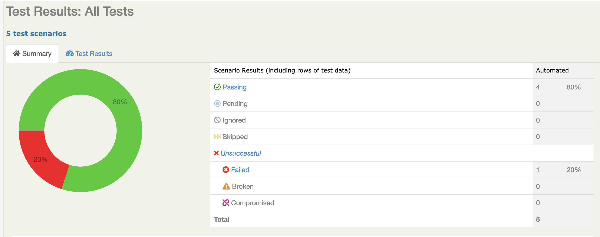
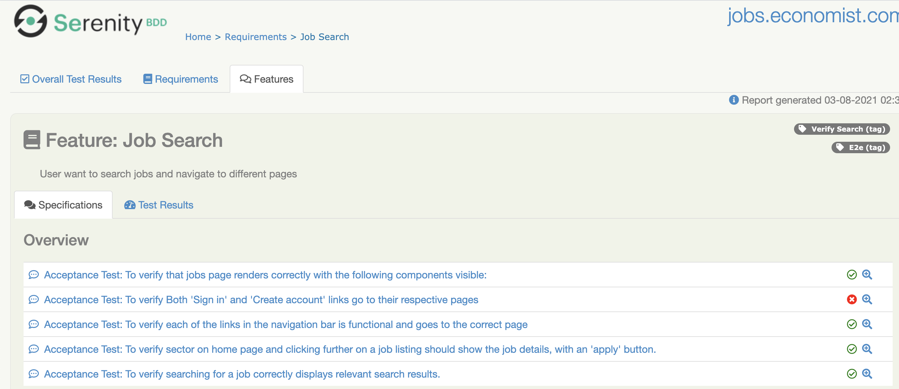
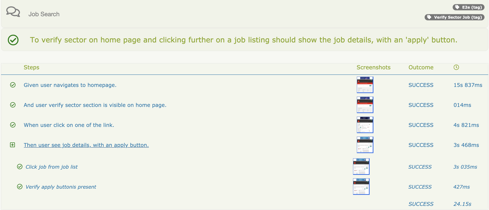

**BDD framework for automation using Serenity**

The framework has following features:

- Modular Design
- Page object model to segregate the locators and actions with actual test
- Maven based framework
- Better Report Generation (serenity-cucumber reporting)
- Centralized Configuration (Using Properties file)
- Custom Exception for easy analysis of the failures
- Data-Driven to run the test on multiple data

**Project structure**
- The Cucumber feature files have .feature extension. This is where the human readable tests are written/stored.
- The test code is in the stepdefination folder.
- The Runner class 'glues' classes in stepdefination by matching the step names. The Runner class also is the main class triggered by junitTest. 
- The webdrivermanager handled the creation of the browser instance.

```
.pom.xml
\---rerun
    \---rerun.txt
serenity.conf
\---src
    +---main
    |   +---java
    |   |   \---com
    |   |        |----enum
    |   |        |----exception
    |   |        |    \----BrowseBySectorException.java
    |   |        |         LinkNotVisibleException.java
    |   |        |         NavigationBarException.java
    |   |        |         PageHeadingException.java
    |   |        |         PageRedirectException.java
    |   |        |         SearchException.java         
    |   |        |----global
    |   |        |     \---Config.java
    |   |        |         LocalConfig.java
    |   |        |----maths
    |   |        |     \---Addition.java
    |   |        |         Division.java
    |   |        |         Multiplication.java
    |   |        |         Substraction.javaa                          
    |   |        |----modals
    |   |        |     \---Search.java  
    |   |        |
    \---test     |
        +---java
        |   \---automation
        |        |     \----TestE2E.java
        |        |          UnitTests.java   
        |        pages
        |        |     \---HomePage.java
        |        |         JobsPage.java
        |       stepDefination
        |        |     \---DataTableConfigurer.java
        |        |         HomePageStepDef.java
        |        |         Hooks.java
        |       steps
        |        |     \---VerifyHomePage.java
        |        |         VerifyJobsPage.java
        |       utils
        |        |     \---VerifyBrokenLinks.java
        |        |
        \---resources
            \---features
            |       E2ETest.featureTestSuite_basket.feature
            |   
            serenity.conf    
```

**Setup**:
- Install Java 8
- Install Maven Maven

**Run tests:**
```
mvn clean verify OR mvn clean verify -Dcucumber.options="--tags @e2e" - Run specific test scripts using Chrome browser.
```

**View HTML Report**
- HTML report will be generated once execution finish -bdd-cucumber\target\site\serenity
- Open Index.html in browser to see the reports





**Setting jenkins pipeline for Selenium(Cucumber serenity project)**
This project is example how can setup jenkins pipeline for selenium project step by step

**Setup**
- Download latest jenkins.war Jenkins download link
- Start jenkins.jar on default port using command 'java -jar jenkins.war'
- Start jenkins.jar on specific port using command 'java -jar jenkins.war --httpPort=portnumber'
- Open localhost:portnumber and login using displayed insructions on browser screens
- Now install all default plugin and set user & password
- Installing required plugins
- Navigate to jenkins home and click on "Manage jenkins" tab
- Now click on "Manage plugins"
- In "Available plugins" tab, perform serach for "Pipeline Maven Integration" and install
- Follwing above steps, install "HTML Publisher" plugin

**Setting up Java-jdk and maven**
- Navigate to "Manage jenkins->Global Tool configuration"
- Configure java-jdk & maven with java8 & maven_3_5_0 name respectivelly
- Global configuration for Github
- Navigate to "Manage jenkins->Configure System" and in Github section configure github credentials

**Creating jenkins pipe line**
- Navigate to "/Jenkinsfile".
- Now navigate to click New Item and create pipeline type of job
- Now navigate to pipeline section of job and select "Pipeline script from SCM"
- Enter repositary url and select github credentials and keep other details default
- Save the changes
- Running created pipeline
- Click build now and execution will be started
- Pipeline steps will be displayed on jenkins screen
- Once execution finish, Click on "HTML Report" tab to view serenity HTML Reports.
